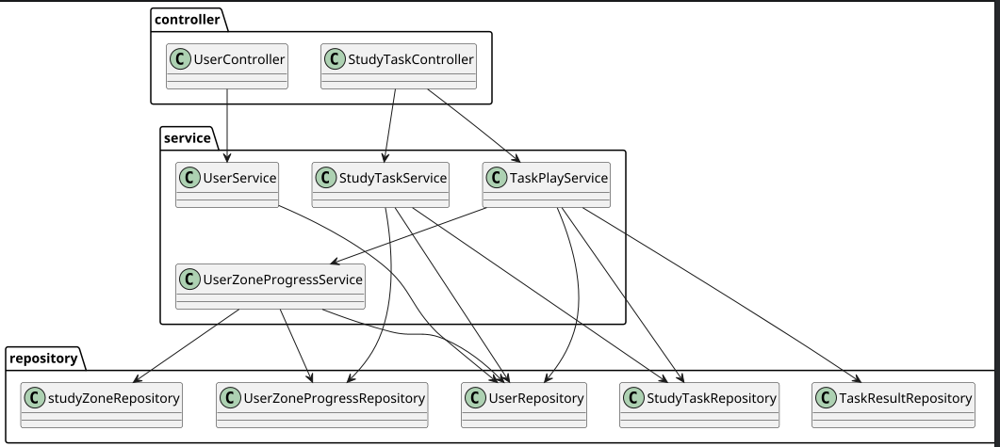
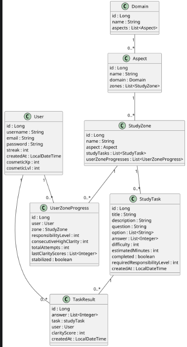

# Fraedrasil

Fraedrasil is a backend engine for an adaptive educational platform inspired by video game progression mechanics.

The goal is to transform learning into short feedback cycles: action → feedback → progression.

## Concept

The progression system is structured in four levels:

Domain → Aspect → Zone → Task

Each task represents a learning activity.  
When a user plays a task, the backend calculates a **clarity score**, which updates the user’s progression.

## Architecture

The backend follows a layered architecture:

Controller → Service → Repository → Entity

- Controller: exposes the REST API
- Service: contains the business logic
- Repository: handles database access
- Entity: represents the data model

## Tech Stack

- Java
- Spring Boot
- Spring Data JPA
- Hibernate
- PostgreSQL

## Data Model

Domain  
→ Aspect  
→ Zone  
→ Task

User interactions create **TaskResult** entries which update **UserZoneProgress**.

## API Endpoints

### Users

POST /api/users  
GET /api/users  
GET /api/users/{id}  
GET /api/users/{id}/progression

### Tasks

GET /api/tasks  
POST /api/tasks/{userId}  
POST /api/tasks/{userId}/{taskId}/play

## Example Flow

1. A user retrieves a list of tasks
2. The user plays a task
3. The backend calculates a clarity score
4. A TaskResult is stored
5. The user progression is updated

## Future Improvements

- adaptive difficulty system
- learning sessions
- authentication
- frontend interface

## Quick Links
- Git Hub : https://github.com/CNdarpiix/Fraedrasil-1
- API : https://fraedrasil-v1.onrender.com
- Live swagger : https://fraedrasil-v1.onrender.com/swagger-ui/index.html